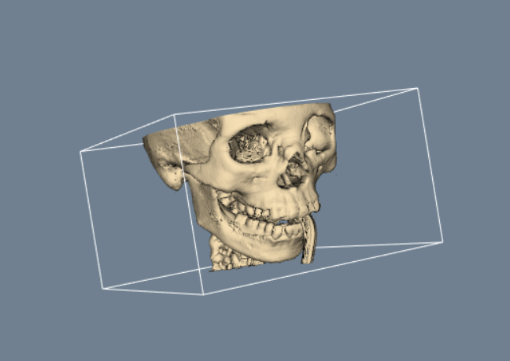

# python-labor-bm
Laborübungen zum Fach "Bildgestützte Medizin und Navigation"

Beispielbild aus Laborübung 5: 3D-Modell aus CT-Bildern mittels VTK (marching cubes algorithm)

Davor- und Danachbild. Findung der Zusammenhänge aus zwei Bildern mittels Gradientenabstiegsverfahren. (Metrik = Entropie)
